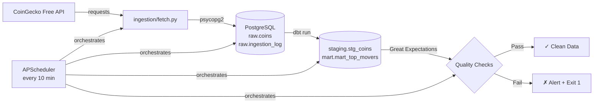

# CryptoFlow

An end-to-end, fully automated data pipeline that ingests live cryptocurrency market data, transforms it through a layered data warehouse, schedules it to run every 10 minutes, and validates data quality on every run.

Built as a portfolio project demonstrating production-grade data engineering practices.

---

## Architecture



---

## Tech Stack

| Layer | Tool |
|---|---|
| Language | Python 3.11 |
| Ingestion | `requests`, `pandas`, `psycopg2` |
| Storage | PostgreSQL (local, via Postgres.app) |
| Transformation | dbt-postgres |
| Orchestration | APScheduler (Airflow DAG also included) |
| Data Quality | Great Expectations 1.x |
| Version Control | Git + GitHub |

---

## Database Schema

```
PostgreSQL: cryptoflow
│
├── raw/                        ← append-only, source of truth
│   ├── coins                   ← 1 row per coin per run
│   └── ingestion_log           ← audit log for every pipeline run
│
├── staging/                    ← cleaned + deduplicated (dbt views)
│   └── stg_coins
│
└── mart/                       ← analytics-ready (dbt tables)
    └── mart_top_movers         ← latest price + movement category per coin
```

---

## Project Structure

```
cryptoflow/
├── ingestion/
│   └── fetch.py            ← hits CoinGecko, loads into raw.coins
├── db/
│   └── schema.sql          ← creates raw, staging, mart schemas + tables
├── dbt/
│   └── cryptoflow/
│       ├── models/
│       │   ├── staging/stg_coins.sql
│       │   └── mart/mart_top_movers.sql
│       └── macros/generate_schema_name.sql
├── dags/
│   └── cryptoflow_dag.py   ← Airflow DAG (orchestration design reference)
├── expectations/
│   └── validate.py         ← GX 1.x null, anomaly, freshness checks
├── scheduler.py            ← APScheduler: runs full pipeline every 10 min
├── requirements.txt
└── README.md
```

---

## Quickstart

### Prerequisites
- Python 3.11
- [Postgres.app](https://postgresapp.com) running on `localhost:5432`
- Database `cryptoflow` created

### Setup

```bash
git clone https://github.com/jesca20/cryptoflow.git
cd cryptoflow

python3.11 -m venv venv
source venv/bin/activate
pip install -r requirements.txt
```

Create `db/config.py` (gitignored):

```python
DB_CONFIG = {
    "host": "localhost",
    "port": 5432,
    "database": "cryptoflow",
    "user": "<your_postgres_user>",
    "password": "",
}
```

Apply the schema:

```bash
psql -h localhost -U <your_user> -d cryptoflow -f db/schema.sql
```

Configure dbt profile at `~/.dbt/profiles.yml` — see `dbt/cryptoflow/dbt_project.yml` for the expected profile name (`cryptoflow`).

### Run once

```bash
python -m ingestion.fetch                   # ingest → raw.coins
cd dbt/cryptoflow && dbt run                # transform → staging + mart
cd ../.. && python expectations/validate.py  # validate data quality
```

### Run on schedule (every 10 minutes)

```bash
python scheduler.py
```

---

## Data Quality Checks

Run automatically after every ingestion + transformation cycle:

| Check | Column | Rule |
|---|---|---|
| Not null | `id`, `symbol`, `name`, `current_price`, `ingested_at` | No nulls allowed |
| Price anomaly | `current_price` | Must be > 0 |
| Row count | table | Between 1 and 100 rows per batch |
| Freshness | `ingested_at` | Latest row within 20 minutes |

---

## Pipeline Output Sample

```
── CryptoFlow Data Quality Validation ──
  Run at: 2026-05-08 00:34:51

  Rows in latest batch: 50

  [PASS] Freshness check — latest row is 0m old (threshold: 20m)
  [PASS] ExpectColumnValuesToNotBeNull — id
  [PASS] ExpectColumnValuesToNotBeNull — current_price
  [PASS] ExpectColumnValuesToBeBetween — current_price
  [PASS] ExpectTableRowCountToBeBetween — table

  ✓ All checks passed.
```

---

## Key Design Decisions

- **`raw` schema is append-only** — every API response is preserved for full auditability and replayability
- **dbt deduplication in staging** — `ROW_NUMBER()` over `(id, date_trunc('minute', ingested_at))` prevents duplicate mart rows without touching raw data
- **Ingestion log** — every run (success or failure) is recorded with row count and error message
- **Type enforcement at ingest** — `pd.to_numeric(..., errors='coerce')` prevents bad API data from breaking the insert
- **Airflow DAG included** — `dags/cryptoflow_dag.py` documents the intended orchestration design; APScheduler is used locally due to macOS compatibility

---

## Author

Jesic — CS/Software Engineering, Nepal
